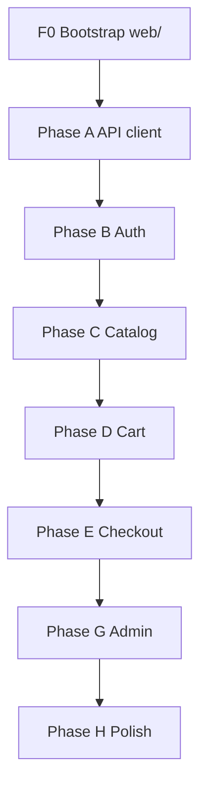

# Luxian — Frontend Learning Report

> **Living document.** Single source of truth for storefront status, discoveries, and progress.  
> **Update after every completed step** (see [Progress log](#progress-log) at the bottom).

---

## How we work together (mentor ↔ student)

Same contract as the API track (`api/LEARNING_REPORT.md`). Speed is not the goal — **understanding that sticks** is.

| Principle | What it means for you |
|-----------|------------------------|
| **Orient first** | Before code: *what* we build, *where* in `web/`, *how* it talks to the Nest API. |
| **Why before how** | Tie choices to Next/React/HTTP concepts — not vague “best practice.” |
| **Elaborate, don’t skim** | Full sentences; analogies welcome (e.g. Query cache = pantry, Context = wallet for tokens). |
| **One concept per step** | Small diffs. Don’t wire auth + checkout in one step unless you ask. |
| **After every change, four questions** | 1) What changed? 2) Why? 3) What to remember? 4) How to rebuild from scratch? |
| **No silent rewrites** | Explain plan before multi-file changes. |
| **Honest about gaps** | Call out stubs (localStorage XSS tradeoff, no Stripe UI, etc.). |
| **You can challenge** | “Why not cookies?” / “Why TanStack Query?” — fair game. |

### Workflow: you code, mentor reviews

| Phase | Who does what |
|-------|----------------|
| **Before** | Mentor explains step (orient, why, files, hints — **no full solution paste** unless you ask). |
| **During** | **You** edit locally. |
| **After** | You say e.g. *“check F2”* or *“done with B4”* → mentor reviews, corrects, updates this report. |

**Cursor rule:** `web/rules/nextjs-learning-mentor.mdc`

---

## Stack (agreed)

| Layer | Choice | Why it fits the API |
|-------|--------|---------------------|
| Framework | **Next.js (App Router) + TypeScript** | Same language as Nest; routes match store flows; RSC for catalog reads. |
| UI | **Tailwind + shadcn/ui** (your preset theme) | Fast forms, tables, toasts; matches luxury/minimal direction. |
| Server state | **TanStack Query** | Cache products; mutate cart; invalidate after checkout. |
| Auth | **React Context + `localStorage`** | API returns JWTs in JSON body — matches Postman flow; document XSS tradeoff. |
| HTTP | **`fetch` wrapper** in `lib/api-client.ts` | Bearer header, JSON parse, unified errors from `HttpExceptionFilter`. |
| Forms | **React Hook Form + Zod** | Mirror Nest DTO rules (password, slug, quantity). |
| API | **Existing Nest** at `http://localhost:3000/api/v1` | No Prisma on frontend; no duplicate business rules. |

**Ports:** API `3000`, Next dev **`3001`** (avoid clash).

---

## 0. Bootstrap — create `web/` (do once)

### Why this matters

Luxian is one **git repo** at the root (`luxian/`). The storefront must live in `web/` as a normal folder — **not** a second git repository inside it.

### Scaffold command (from repo root)

Run from `luxian/` (parent of `api/`), **not** inside `api/`:

```bash
npx shadcn@latest init --preset b1G2AXDzm --template next --pointer --no-monorepo -n web -y
```

> **If init complains that `web/` is not empty:** this repo may already contain `web/rules/` (mentor Cursor rule). Either temporarily move `web/rules` aside, run init, then move it back — or delete `web/` entirely first (only if it has no app code yet).

| Flag | Purpose |
|------|---------|
| `--preset b1G2AXDzm` | Your theme (colors, radius, fonts). |
| `--template next` | Next.js App Router app. |
| `--pointer` | Pointer cursor on buttons (your preference). |
| `--no-monorepo` | **Important:** do **not** scaffold shadcn’s Turborepo (`apps/web` + `packages/ui`). We already have a monorepo: `api/` + `web/`. |
| `-n web` | Project folder name → `luxian/web/`. |
| `-y` | Non-interactive; skip prompts. |

> **Note:** The shadcn CLI has **no `--no-git` flag**. It may run `git init` inside `web/` as post-install. That creates a **nested repo**, which is awkward with the root repo.

### After scaffold — remove nested git (required check)

**PowerShell (repo root):**

```powershell
if (Test-Path web\.git) { Remove-Item -Recurse -Force web\.git }
```

**Bash:**

```bash
rm -rf web/.git
```

Then confirm only the root repo exists:

```bash
git status
```

You should see `web/` files as untracked/new under the **root** repo — not a submodule.

### If the CLI asks about monorepo interactively

Choose **No** — single Next app in `web/`, not shadcn’s `apps/web` + `packages/ui` layout.

### Post-scaffold checklist (F0)

- [x] **F0.1** — Run init command above; `web/` exists with `app/`, `components.json`, Tailwind, shadcn theme.
- [x] **F0.2** — Delete `web/.git` if present; verify root `git status` lists `web/`.
- [x] **F0.3** — Set dev port **3001** in `web/package.json` (`"dev": "next dev -p 3001"`).
- [x] **F0.4** — Add `web/.env.example` with `NEXT_PUBLIC_API_URL=http://localhost:3000/api/v1`; copy to `web/.env.local` (gitignored).
- [x] **F0.5** — **API:** enable CORS in `api/src/main.ts` for `http://localhost:3001` (browser blocks cross-origin without it).
- [x] **F0.6** — Install TanStack Query + React Hook Form + Zod:  
  `cd web && npm install @tanstack/react-query @tanstack/react-query-devtools react-hook-form @hookform/resolvers zod`
- [x] **F0.7** — Add shadcn pieces you’ll need early:  
  `npx shadcn@latest add button input label card form sonner skeleton -c web`

**Acceptance:** With API running (`cd api && npm run dev`), open `http://localhost:3001` — default Next page loads; no CORS errors once F0.5 is done and you add a test `fetch` in a client component.

---

## 1. Target project structure

```
luxian/
├── api/                          # Nest — done (see api/LEARNING_REPORT.md)
├── web/                          # Next storefront (this track)
│   ├── app/
│   │   ├── layout.tsx            # Root layout, providers, fonts
│   │   ├── page.tsx              # Home / featured products
│   │   ├── (auth)/
│   │   │   ├── login/page.tsx
│   │   │   └── register/page.tsx
│   │   ├── products/
│   │   │   ├── page.tsx          # Catalog
│   │   │   └── [id]/page.tsx     # Detail
│   │   ├── cart/page.tsx
│   │   ├── checkout/page.tsx
│   │   ├── account/
│   │   │   └── orders/
│   │   │       ├── page.tsx
│   │   │       └── [id]/page.tsx
│   │   └── admin/                # ADMIN role only (UI gate + API 403)
│   │       ├── layout.tsx
│   │       ├── categories/page.tsx
│   │       └── products/page.tsx
│   ├── components/               # UI + feature components
│   ├── lib/
│   │   ├── api-client.ts         # fetch + auth header + errors
│   │   ├── auth-storage.ts       # localStorage read/write
│   │   ├── format-price.ts       # Prisma Decimal → display string
│   │   └── query-keys.ts         # TanStack Query key factory
│   ├── features/                 # Optional: group by domain
│   │   ├── auth/
│   │   ├── products/
│   │   ├── cart/
│   │   └── orders/
│   ├── providers/
│   │   ├── query-provider.tsx
│   │   └── auth-provider.tsx
│   ├── .env.example
│   └── rules/
│       └── nextjs-learning-mentor.mdc
└── FRONTEND_LEARNING_REPORT.md   # ← this file
```

**Mental model:** **Page** (route) → **components** → **hooks / Query** → **api-client** → **Nest** → **Postgres**.  
The frontend never touches the database.

---

## 2. API contract (what the UI must respect)

Base URL: `NEXT_PUBLIC_API_URL` → `http://localhost:3000/api/v1`

### Auth

| Method | Path | Auth | Response / notes |
|--------|------|------|------------------|
| POST | `/auth/register` | — | `{ accessToken, refreshToken, user }` |
| POST | `/auth/login` | — | same |
| POST | `/auth/refresh` | body `{ refreshToken }` | new tokens |
| POST | `/auth/logout` | Bearer | `{ message }` |
| GET | `/auth/me` | Bearer | `AuthUser` (no password) |
| GET | `/auth/admin-only` | Bearer ADMIN | 403 if USER |

**Token flow (client):**

1. Save tokens on login/register.
2. Send `Authorization: Bearer <accessToken>` on protected routes.
3. On **401**, call `/auth/refresh` once, retry request; if still 401 → clear storage → redirect login.
4. On app load, if tokens exist → `GET /auth/me` to hydrate user.

**Learning tradeoff:** `localStorage` is simple and matches your API; it is **vulnerable to XSS**. Production apps often use `httpOnly` cookies — that requires API changes later.

### Catalog (mostly public reads)

| Method | Path | Auth | Notes |
|--------|------|------|-------|
| GET | `/categories` | — | Active categories |
| POST/PATCH/DELETE | `/categories` | ADMIN | Writes |
| GET | `/products` | — | Query `?categoryId=` optional |
| POST/PATCH/DELETE | `/products` | ADMIN | Writes |

**Prices:** JSON may return `price` as **string** (Prisma `Decimal`). Use a formatter; don’t do `price * 1.1` as raw float without care.

### Cart (authenticated shopper)

| Method | Path | Notes |
|--------|------|-------|
| GET | `/cart` | Full cart + nested `product` |
| POST | `/cart/items` | `{ productId, quantity }` |
| PATCH | `/cart/items/:productId` | `{ quantity }` |
| DELETE | `/cart/items/:productId` | Remove line |

**Common bug:** `GET /cart/items` does **not** exist (404).

### Orders & payments

| Method | Path | Notes |
|--------|------|-------|
| POST | `/orders/checkout` | Optional `{ shippingAddress }`; pay + stock in one step |
| GET | `/orders` | User’s orders |
| GET | `/orders/:id` | Detail + payment |
| GET | `/payments/orders/:orderId` | Payment record |

After checkout, cart is empty; order `status` is `PROCESSING`, payment `COMPLETED` (stub).

### Errors (global filter)

```json
{
  "statusCode": 400,
  "message": "Validation failed" ,
  "path": "/api/v1/...",
  "timestamp": "..."
}
```

`message` may be a **string** or **string[]** — normalize in the UI for toasts and form errors.

| Status | Usual meaning in UI |
|--------|---------------------|
| 400 | Show field errors / toast |
| 401 | Refresh or redirect login |
| 403 | “Not allowed” (e.g. non-admin on admin page) |
| 404 | Not found page or empty state |
| 409 | Duplicate email / slug / SKU |

**Reference:** `api/POSTMAN_TESTING.md` — same flows, manual QA.

### Demo data (after `npm run db:seed` in `api/`)

| Email | Password | Role |
|-------|----------|------|
| `user@demo.com` | `Secret1!` | USER |
| `admin@demo.com` | `Secret1!` | ADMIN |

---

## 3. Gap vs “real” storefront (expected)

| Gap | Notes |
|-----|--------|
| No OpenAPI / shared types package | Hand-write TS types from DTOs; optional later. |
| No httpOnly cookies | Bearer + localStorage for learning. |
| No Stripe UI | Checkout hits stub pay on API. |
| No image CDN | Use `imageUrl` from seed as-is. |
| No SSR auth | `me` fetched client-side; acceptable for learning. |
| CORS | Must add on API before browser testing (F0.5). |

---

## 4. Learning roadmap (phases)

Check off in [Progress log](#progress-log) as you complete steps.

### Phase F — Bootstrap

See [§0. Bootstrap](#0-bootstrap--create-web-do-once) (F0.1–F0.7).

### Phase A — Foundations (API client + Query)

- [x] **A1** — `lib/api-client.ts`: `baseUrl`, `get/post/patch/delete`, JSON headers, parse `HttpExceptionFilter` shape, throw typed `ApiError`.
- [x] **A2** — `lib/query-keys.ts` + `providers/query-provider.tsx` wrap app in `QueryClientProvider` (devtools in dev).
- [x] **A3** — `app/providers.tsx` compose Query + future Auth; wire in root `layout.tsx`.
- [x] **A4** — Dev-only “API ping” on home: `GET /api/v1` → show hello string (proves CORS + env).
- [x] **A5** — `components/site-header.tsx`: logo, nav links (placeholders), no auth yet.

**Remember:** `NEXT_PUBLIC_*` is baked in at **build** time — restart dev server after env changes.

### Phase B — Auth

- [x] **B1** — Types: `AuthUser`, `AuthResponse`, `Role`; `lib/auth-storage.ts` get/set/clear tokens + user snapshot.
- [x] **B2** — `providers/auth-provider.tsx`: state, `login`, `register`, `logout`, `loadMe` on mount.
- [x] **B3** — Extend api-client: attach Bearer from storage; refresh on 401 via `auth/refresh`.
- [x] **B4** — `app/(auth)/login/page.tsx` + register page: React Hook Form + Zod (password rules match API).
- [x] **B5** — On success → save tokens, set user, redirect `/` or `?redirect=`.
- [x] **B6** — Header: show email + logout; hide login when session exists.
- [x] **B7** — `components/require-auth.tsx` (client): redirect to `/login` if no session (cart placeholder).
- [ ] **B8** — Optional: `middleware.ts` only for coarse redirects — **JWT in middleware is limited**; prefer client guard + `me` for learning.

### Phase C — Catalog (shopper)

- [x] **C1** — `features/products/api.ts`: `getProducts`, `getProduct` (if you add by-id route later, or filter client-side from list).
- [x] **C2** — `app/products/page.tsx`: grid, loading skeleton, error toast.
- [x] **C3** — `app/products/[id]/page.tsx`: detail, price, stock, add-to-cart button (disabled if stock 0).
- [x] **C4** — `lib/format-price.ts` + use on all price displays.
- [x] **C5** — Home `page.tsx`: featured section (e.g. first N products from query).

### Phase D — Cart

- [x] **D1** — `useCart` query: `GET /cart`, key `['cart']`.
- [x] **D2** — Mutations: add / update / remove; `invalidateQueries(['cart'])` on success.
- [x] **D3** — `app/cart/page.tsx`: line items, qty stepper, subtotal (sum line `quantity * price`).
- [x] **D4** — Header cart badge (item count from cart query).
- [x] **D5** — Require auth for cart routes (guest → login with return URL).

### Phase E — Checkout & orders

- [x] **E1** — `app/checkout/page.tsx`: shipping address (optional), review lines, place order button.
- [x] **E2** — `POST /orders/checkout` mutation; on success → redirect `/account/orders/[id]`.
- [x] **E3** — `app/account/orders/page.tsx`: list orders (`GET /orders`).
- [x] **E4** — `app/account/orders/[id]/page.tsx`: detail + payment status.
- [x] **E5** — Handle 400 “Cart is empty” with friendly message.

### Phase G — Admin (after shopper path works)

- [x] **G1** — `app/admin/layout.tsx`: check `user.role === 'ADMIN'`; else redirect or 403 page.
- [x] **G2** — Categories: table + create/edit dialog (POST/PATCH/DELETE).
- [x] **G3** — Products: table + form (category select, sku, price, stock).
- [x] **G4** — Smoke test: login as `admin@demo.com`, create category + product, see on public catalog.

### Phase H — Polish

- [ ] **H1** — `sonner` toasts for API errors (normalize `message` array).
- [ ] **H2** — Empty states (empty cart, no orders, no products).
- [ ] **H3** — `loading.tsx` / skeletons on main routes.
- [ ] **H4** — Update root `README.md` with web quick start.
- [ ] **H5** — Optional: extract shared API types to `packages/types` — **only if you want extra monorepo practice**.

---

## 5. Suggested build order (one path through the store)



**Milestone 1 (MVP shopper):** F0 → A → B → C → D → E — browse, login, cart, checkout, view orders.  
**Milestone 2:** G — admin CRUD.  
**Milestone 3:** H — UX polish.

---

## 6. API change for F0.5 (CORS) — snippet to add

In `api/src/main.ts`, after `NestFactory.create`:

```typescript
app.enableCors({
  origin: process.env.CORS_ORIGIN ?? 'http://localhost:3001',
  credentials: true,
});
```

Add to `api/.env.example`: `CORS_ORIGIN=http://localhost:3001`

**Why:** Browsers enforce same-origin policy. Postman ignores CORS; the Next app does not.

---

## 7. Four questions template (copy per step)

After each step, answer:

1. **What changed?** (files + behavior)
2. **Why?** (concept: e.g. Query cache, Context, Server vs Client Component)
3. **What should I remember?**
4. **How would I rebuild it without the repo?**

---

## Progress log

_Update after every reviewed step._

| Date | Step | Summary | Concepts to remember |
|------|------|---------|----------------------|
| 2026-05-26 | — | Frontend plan written; stack aligned with Nest API | Thin client; no nested git in `web/`; port 3001; Bearer + refresh |
| 2026-05-26 | F0 + A1–A5 | API client, Query provider, home ping, site header | `api.get`; Query keys factory; CORS + env for browser fetch |
| 2026-05-26 | B1–B7 | Auth storage, provider, login/register, header, require-auth | Bearer + refresh on 401; localStorage session; demo `user@demo.com` / `Secret1!` |
| 2026-05-26 | C1–C5 | Product types, grid, detail, formatPrice, home featured | `GET /products` public; detail finds id from list (no GET by id on API yet) |
| 2026-05-26 | D1–D5 | Cart API, hooks, line items, badge, add-to-cart | `useMutation` + invalidate `queryKeys.cart`; JWT required on `/cart` |
| 2026-05-26 | E1–E5 | Checkout, orders list/detail | `POST /orders/checkout` invalidates cart + orders; stub pay COMPLETED |
| 2026-05-26 | G1–G4 | Admin layout, categories/products CRUD | `RequireAdmin` + ADMIN nav link; 403 for non-admin |

### Current focus

**Next:** **Phase H — Polish** (toasts, empty states, README).

### Notes & questions (your scratchpad)

_Add “aha” moments and blockers here._

---

## Changelog (report versions)

| Version | Date | Change |
|---------|------|--------|
| 1.0 | 2026-05-26 | Initial frontend learning plan + bootstrap instructions |
